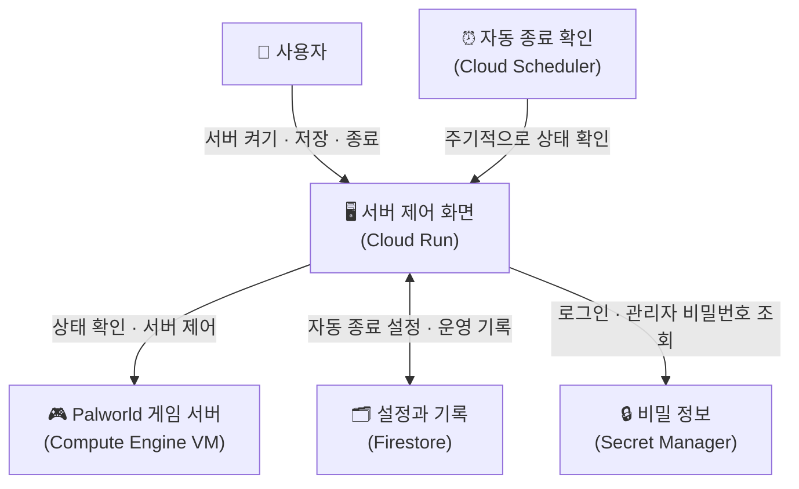

# Palworld Control Dashboard

## 필요한 GCP 서비스

- **Cloud Run**: Next.js 제어 대시보드를 실행한다. 로그인 요청을 처리하고, VM 상태 조회·시작·종료와 Palworld REST API 호출을 중계한다.
- **Compute Engine**: Palworld Docker Compose 서버가 실행되는 VM을 제공한다. Cloud Run 서비스 계정에는 이 VM을 조회·시작·중지할 권한이 필요하다.
- **Firestore**: 자동 종료 설정, 서버가 비어 있던 시각, 마지막 제어 이력을 저장한다.
- **Cloud Scheduler**: 일정 주기로 `POST /api/autostop`을 호출해 접속자가 없는 서버를 자동 종료한다.
- **Secret Manager**: 대시보드 로그인 비밀번호, 세션 서명 키, Palworld 관리자 비밀번호, Scheduler 인증 secret을 안전하게 보관한다.
- **VPC (default network)**: Cloud Run이 VM의 private IP에 있는 Palworld REST API에 접근할 수 있게 한다. Cloud Run의 VPC egress 설정이 필요하다.

## 아키텍처

사용자는 제어 화면에서 서버를 켜고, 저장하고, 종료할 수 있다. 사람이 없을 때는 자동 종료 기능이 서버를 안전하게 끈다.

아래 그림은 이 기능들이 어떻게 연결되는지 사용자 관점에서 보여준다. 괄호 안은 실제 사용 중인 GCP 서비스다.



## 배포 전 준비

Firestore 데이터베이스를 만들고 Cloud Run 서비스 계정에 읽기·쓰기 권한을 준다. 기본 문서 경로는 `serverControl/palworld`이며 첫 상태 변경 때 자동 생성된다.

문서를 미리 만들 경우 아래 값으로 시작하면 된다.

```json
{
  "autoStopEnabled": true,
  "emptySince": null,
  "lastStartedAt": null,
  "lastStoppedAt": null,
  "lastActionBy": null,
  "lastActionType": null
}
```

아래 Secret Manager 표의 secret을 만들고 Cloud Run 환경변수로 연결한다. Cloud Run 서비스 계정에는 Secret Manager 접근 권한이 필요하다.

Cloud Scheduler는 주기적으로 `POST /api/autostop`을 호출하도록 만든다. 인증은 OIDC 또는 `AUTOSTOP_SECRET` 중 하나를 사용한다.

Cloud Run 서비스 계정에는 VM 조회·시작·중지 권한이 필요하다. Cloud Run에서 VM 내부 IP의 Palworld REST API 포트로 접근할 수 있어야 한다.

## 환경변수

### Secret Manager

| 환경변수 | 역할 |
| --- | --- |
| `WEB_CONTROL_PASSWORD` | 대시보드 로그인 비밀번호 |
| `SESSION_SECRET` | 세션 쿠키 서명 키 |
| `PALWORLD_ADMIN_PASSWORD` | REST API 비밀번호 |
| `AUTOSTOP_SECRET` | Scheduler 호출 인증용 secret. OIDC 사용 시 생략 가능 |

### 일반 환경변수

| 환경변수 | 역할 |
| --- | --- |
| `CONTROL_PANEL_MOCK` | 로컬 테스트용 mock 사용 여부 |
| `GCP_PROJECT_ID` | GCP 프로젝트 ID |
| `GCP_ZONE` | VM zone |
| `GCP_INSTANCE_NAME` | Palworld VM 이름 |
| `PALWORLD_REST_BASE_URL` | Palworld REST API 주소 (`/v1/api` 포함) |
| `PALWORLD_ADMIN_USERNAME` | REST API 사용자명 |
| `FIRESTORE_STATE_COLLECTION` | 상태를 저장할 Firestore collection |
| `FIRESTORE_STATE_DOCUMENT` | 상태를 저장할 Firestore document |
| `AUTOSTOP_ENABLED_DEFAULT` | 자동종료 기본값 |
| `AUTOSTOP_OIDC_AUDIENCE` | Scheduler OIDC audience |
| `AUTOSTOP_SCHEDULER_SERVICE_ACCOUNT` | Scheduler 서비스 계정 |
| `AUTOSTOP_GRACE_MINUTES` | 서버 시작 후 보호시간(분) |
| `AUTOSTOP_EMPTY_MINUTES` | 0명 상태 유지시간(분) |
| `PALWORLD_STATUS_TIMEOUT_MS` | metrics/status timeout |
| `PALWORLD_PLAYERS_TIMEOUT_MS` | players timeout |
| `PALWORLD_SAVE_TIMEOUT_MS` | save timeout |
| `PALWORLD_SHUTDOWN_TIMEOUT_MS` | shutdown timeout |
| `PALWORLD_SHUTDOWN_WAIT_SECONDS` | shutdown 후 VM 중지 전 대기시간 |
| `COMPUTE_OPERATION_TIMEOUT_MS` | VM start/stop timeout |
