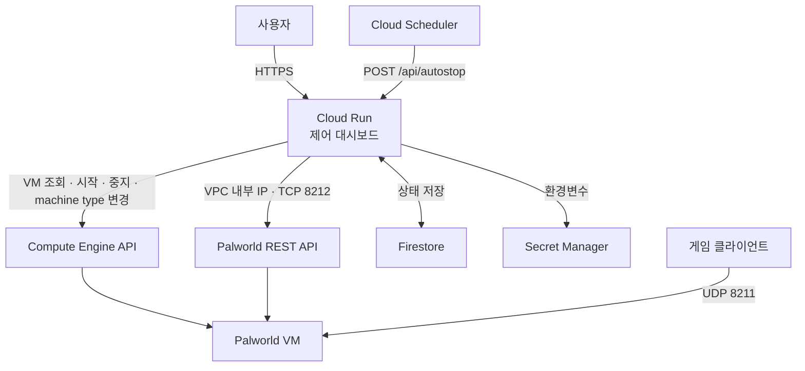

# Palworld Control Dashboard

Cloud Run에서 Palworld VM을 제어하는 대시보드입니다. VM 시작·중지, 서버 상태·접속자 조회, 저장·종료, 자동 종료와 2단계 VM 사양 프로필을 지원합니다.

이 문서는 완전한 설치 튜토리얼이 아니라, 직접 GCP 리소스를 구성할 때 필요한 구조와 설정 항목을 정리한 문서입니다.

## 아키텍처



## 필요한 GCP 리소스

| 리소스 | 용도 |
| --- | --- |
| Cloud Run | 대시보드 실행 |
| Compute Engine | Palworld Docker Compose VM |
| Firestore Native Mode | 자동 종료 상태와 제어 이력 (`serverControl/palworld`) |
| Secret Manager | 로그인·세션·Palworld 관리자 비밀번호 |
| Cloud Scheduler | `/api/autostop` 주기 호출 |
| Artifact Registry | Cloud Run 배포 이미지 저장 |
| VPC / Firewall | Cloud Run과 VM 내부 통신 |

활성화할 API는 Cloud Run, Compute Engine, Firestore, Secret Manager, Cloud Scheduler, Artifact Registry입니다. Serverless VPC Access connector를 사용할 때만 Serverless VPC Access API도 필요합니다.

## VM과 Palworld 준비

- Docker Compose로 Palworld를 실행합니다.
- `Saved` 폴더는 VM 디스크 경로에 bind mount합니다.
- VM에 `palworld-server` network tag를 지정합니다.
- `PalWorldSettings.ini`에서 REST API를 활성화하고 `RESTAPIPort`를 `8212`로 맞춥니다.
- `AdminPassword`는 `PALWORLD_ADMIN_PASSWORD`와 동일해야 합니다.
- Docker Compose에서 게임 포트와 REST API 포트를 VM에서 수신하도록 매핑합니다.

게임 포트는 `PublicPort` 설정을 기준으로 확인합니다. 아래 표의 `8211/udp`는 기본 예시입니다.

## VM 사양 프로필

대시보드에서 시작할 때 다음 두 프로필만 선택할 수 있습니다. 클라이언트는 machine type 문자열을 직접 전달할 수 없으며, Cloud Run 환경변수로만 실제 machine type을 결정합니다.

| 프로필 | 기본 machine type | 사양 | 권장 |
| --- | --- | --- | --- |
| 저사양 (`low`) | `e2-highmem-2` | 2 vCPU / 16GB | 1~5명 |
| 일반 (`normal`) | `e2-highmem-4` | 4 vCPU / 32GB | 다인원 또는 거점·작업 팰이 많은 월드 |

실행 중인 서버의 프로필 변경은 저장과 정상 종료 뒤 VM 중지·machine type 변경·재시작을 수행합니다. 접속자가 1명 이상이면 변경이 차단됩니다. 대시보드에 표시되는 요금은 예상값일 뿐이며 실제 청구 금액과 다를 수 있습니다.

## VPC와 방화벽

Cloud Run은 VM의 내부 IP로 REST API에 연결합니다. `PALWORLD_REST_BASE_URL`에는 외부 IP가 아니라 내부 IP를 사용합니다.

```text
http://VM_INTERNAL_IP:8212/v1/api
```

| 용도 | 포트 | source | target |
| --- | --- | --- | --- |
| Palworld 게임 접속 | UDP `8211` | 게임 사용자 또는 `0.0.0.0/0` | `palworld-server` tag |
| Palworld REST API | TCP `8212` | Cloud Run subnet CIDR 또는 VPC Connector CIDR | `palworld-server` tag |
| SSH | TCP `22` | 관리자 IP 또는 IAP | `palworld-server` tag |

Direct VPC egress를 사용하면 Cloud Run 서비스에 VPC network/subnet을 연결하고 egress를 `private-ranges-only`로 설정합니다. 이때 `tcp:8212` 방화벽 source에는 Cloud Run이 사용하는 **subnet CIDR**을 넣습니다. VPC Connector를 쓰는 구성에서는 connector CIDR 또는 connector tag를 사용합니다.

## Cloud Run과 IAM 설정

Cloud Run에는 런타임 서비스 계정, VPC network/subnet, `private-ranges-only` egress를 설정합니다. VM 종료 요청이 완료될 수 있도록 요청 timeout도 설정합니다.

| 주체 | 필요한 권한 |
| --- | --- |
| Cloud Run 런타임 서비스 계정 | `compute.instances.get`, `compute.instances.start`, `compute.instances.stop`, `compute.instances.setMachineType`를 포함한 custom role 또는 `roles/compute.instanceAdmin.v1` |
| Cloud Run 런타임 서비스 계정 | `roles/datastore.user` |
| Cloud Run 런타임 서비스 계정 | `roles/secretmanager.secretAccessor` |
| Scheduler 호출 서비스 계정 | Cloud Run이 IAM 인증을 요구할 때 `roles/run.invoker` |

## Secret Manager

아래 secret을 Cloud Run 환경변수로 연결합니다.

| 환경변수 | 용도 |
| --- | --- |
| `WEB_CONTROL_PASSWORD` | 대시보드 로그인 비밀번호 |
| `SESSION_SECRET` | 세션 서명 키. 운영 환경에서는 24자 이상 |
| `PALWORLD_ADMIN_PASSWORD` | Palworld REST API 비밀번호 |
| `AUTOSTOP_SECRET` | Scheduler shared secret 인증값. OIDC 사용 시 생략 가능 |

## Cloud Scheduler 자동 종료

Scheduler job은 `POST https://<Cloud Run URL>/api/autostop`을 호출합니다.

- OIDC: audience는 Cloud Run 서비스 URL, 호출 서비스 계정은 `AUTOSTOP_SCHEDULER_SERVICE_ACCOUNT`에 설정합니다.
- Shared secret: `x-autostop-secret` 헤더에 `AUTOSTOP_SECRET`을 넣습니다.

자동 종료는 VM 상태와 접속자 수를 확인한 뒤, `AUTOSTOP_EMPTY_MINUTES` 동안 0명 상태가 유지되면 저장·종료 요청 후 VM을 중지합니다.

## 환경변수

| 환경변수 | 역할 |
| --- | --- |
| `CONTROL_PANEL_MOCK` | 로컬 테스트용 mock 사용 여부 |
| `GCP_PROJECT_ID` | GCP 프로젝트 ID |
| `GCP_ZONE` | VM zone |
| `GCP_INSTANCE_NAME` | Palworld VM 이름 |
| `PALWORLD_MACHINE_TYPE_LOW` | 저사양 프로필 machine type. 기본값 `e2-highmem-2` |
| `PALWORLD_MACHINE_TYPE_NORMAL` | 일반 프로필 machine type. 기본값 `e2-highmem-4` |
| `PALWORLD_REST_BASE_URL` | VM 내부 IP 기반 REST API 주소. `/v1/api` 포함 |
| `PALWORLD_ADMIN_USERNAME` | Palworld REST API 사용자명 |
| `FIRESTORE_STATE_COLLECTION` | Firestore collection. 기본값 `serverControl` |
| `FIRESTORE_STATE_DOCUMENT` | Firestore document. 기본값 `palworld` |
| `AUTOSTOP_ENABLED_DEFAULT` | 자동 종료 기본값 |
| `AUTOSTOP_OIDC_AUDIENCE` | Scheduler OIDC audience |
| `AUTOSTOP_SCHEDULER_SERVICE_ACCOUNT` | 허용할 Scheduler 서비스 계정 이메일 |
| `AUTOSTOP_GRACE_MINUTES` | 서버 시작 후 자동 종료 보호 시간(분) |
| `AUTOSTOP_EMPTY_MINUTES` | 0명 상태 유지 시간(분) |
| `PALWORLD_STATUS_TIMEOUT_MS` | 서버 상태 조회 제한 시간(ms) |
| `PALWORLD_PLAYERS_TIMEOUT_MS` | 접속자 목록 조회 제한 시간(ms) |
| `PALWORLD_SAVE_TIMEOUT_MS` | 서버 저장 요청 제한 시간(ms) |
| `PALWORLD_SHUTDOWN_TIMEOUT_MS` | 서버 종료 요청 제한 시간(ms) |
| `PALWORLD_SHUTDOWN_WAIT_SECONDS` | 서버 종료 뒤 VM 중지 전 대기 시간(초) |
| `COMPUTE_OPERATION_TIMEOUT_MS` | VM 시작·중지 제한 시간(ms) |
| `COMPUTE_OPERATION_POLL_INTERVAL_MS` | Compute operation 상태 확인 간격(ms) |
| `CONTROL_OPERATION_LOCK_TIMEOUT_MS` | Firestore 제어 작업 잠금 만료 시간(ms) |

## 배포 후 확인

- [ ] Cloud Run 대시보드 로그인
- [ ] VM 상태 조회 및 시작·저장·종료
- [ ] VM 종료 상태에서 저사양·일반 프로필 각각으로 시작
- [ ] 접속자 0명일 때 프로필 변경 및 VM 재시작, 접속자가 있을 때 변경 차단
- [ ] Cloud Run에서 VM 내부 IP의 REST API와 접속자 목록 조회
- [ ] 게임 클라이언트의 외부 IP·게임 포트 접속
- [ ] Firestore `serverControl/palworld` 문서 갱신
- [ ] Scheduler의 `POST /api/autostop` 호출과 자동 종료
