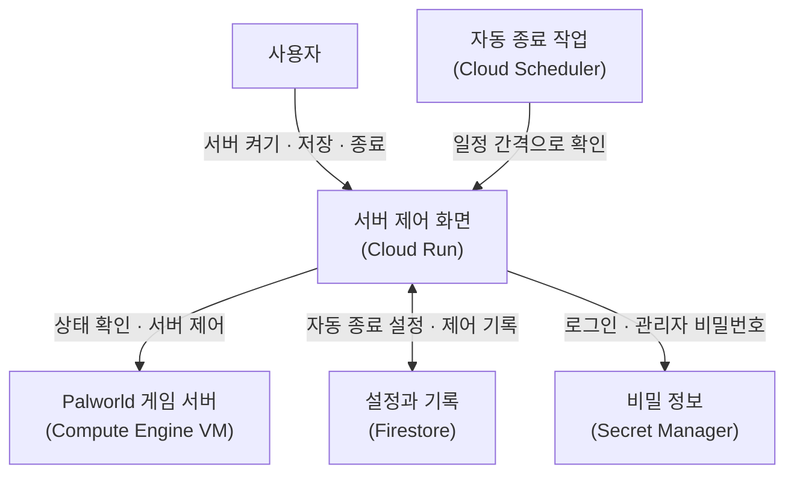

# Palworld Control Dashboard

## 사용하는 GCP 서비스

- **Cloud Run**: 제어 대시보드를 실행한다. 로그인 처리와 VM 제어, Palworld REST API 요청도 여기서 맡는다.
- **Compute Engine**: Palworld Docker Compose 서버가 실행되는 VM이다. Cloud Run 서비스 계정에는 이 VM을 조회하고 시작·중지할 권한이 필요하다.
- **Firestore**: 자동 종료 설정과 마지막 제어 이력을 저장한다.
- **Cloud Scheduler**: 일정 간격으로 자동 종료 API를 호출한다. 접속자가 없는 상태가 오래 이어지면 서버를 끈다.
- **Secret Manager**: 대시보드 로그인 비밀번호, 세션 키, Palworld 관리자 비밀번호, Scheduler 인증값을 보관한다.
- **VPC (default network)**: Cloud Run에서 VM의 내부 IP에 있는 Palworld REST API로 연결할 때 사용한다. Cloud Run의 VPC egress 설정이 필요하다.

## 아키텍처

제어 화면에서 서버를 켜고, 저장하고, 종료할 수 있다. 접속자가 없는 시간이 길어지면 자동 종료가 서버를 끈다.

괄호 안은 각 기능에 사용하는 GCP 서비스다.



## 배포 전 준비

배포 전에 Firestore 데이터베이스를 만들고, Cloud Run 서비스 계정에 읽기·쓰기 권한을 준다. 기본 문서 경로는 `serverControl/palworld`이며, 처음 상태가 바뀔 때 자동으로 생성된다.

문서를 미리 만들려면 아래 값으로 시작한다.

```json
{
  "autoStopEnabled": true,
  "emptySince": null,
  "lastStartedAt": null,
  "lastStoppedAt": null,
  "lastActionBy": null,
  "lastActionType": null
}
```

Secret Manager에 아래 값을 만든 뒤 Cloud Run 환경변수로 연결한다. Cloud Run 서비스 계정에는 해당 secret을 읽을 권한이 필요하다.

Cloud Scheduler는 `POST /api/autostop`을 주기적으로 호출하도록 설정한다. 인증에는 OIDC 또는 `AUTOSTOP_SECRET` 중 하나를 사용한다.

Cloud Run 서비스 계정에는 VM을 조회·시작·중지할 권한이 필요하다. Cloud Run에서도 VM 내부 IP의 Palworld REST API 포트에 연결할 수 있어야 한다.

## 환경변수

### Secret Manager

| 환경변수 | 역할 |
| --- | --- |
| `WEB_CONTROL_PASSWORD` | 대시보드 로그인 비밀번호 |
| `SESSION_SECRET` | 세션 쿠키 서명 키 |
| `PALWORLD_ADMIN_PASSWORD` | REST API 비밀번호 |
| `AUTOSTOP_SECRET` | Scheduler 호출 인증값. OIDC를 사용하면 필요 없음 |

### 일반 환경변수

| 환경변수 | 역할 |
| --- | --- |
| `CONTROL_PANEL_MOCK` | 로컬 테스트에서 모의 동작을 사용할지 여부 |
| `GCP_PROJECT_ID` | GCP 프로젝트 ID |
| `GCP_ZONE` | VM이 있는 zone |
| `GCP_INSTANCE_NAME` | Palworld VM 이름 |
| `PALWORLD_REST_BASE_URL` | Palworld REST API 주소 (`/v1/api` 포함) |
| `PALWORLD_ADMIN_USERNAME` | REST API 사용자명 |
| `FIRESTORE_STATE_COLLECTION` | 상태를 저장할 Firestore collection 이름 |
| `FIRESTORE_STATE_DOCUMENT` | 상태를 저장할 Firestore document 이름 |
| `AUTOSTOP_ENABLED_DEFAULT` | 자동종료 기본값 |
| `AUTOSTOP_OIDC_AUDIENCE` | Scheduler OIDC audience 값 |
| `AUTOSTOP_SCHEDULER_SERVICE_ACCOUNT` | Scheduler 서비스 계정 |
| `AUTOSTOP_GRACE_MINUTES` | 서버 시작 후 보호시간(분) |
| `AUTOSTOP_EMPTY_MINUTES` | 0명 상태 유지시간(분) |
| `PALWORLD_STATUS_TIMEOUT_MS` | 서버 상태 조회 제한 시간(ms) |
| `PALWORLD_PLAYERS_TIMEOUT_MS` | 접속자 목록 조회 제한 시간(ms) |
| `PALWORLD_SAVE_TIMEOUT_MS` | 서버 저장 요청 제한 시간(ms) |
| `PALWORLD_SHUTDOWN_TIMEOUT_MS` | 서버 종료 요청 제한 시간(ms) |
| `PALWORLD_SHUTDOWN_WAIT_SECONDS` | 서버 종료 뒤 VM을 끄기 전 대기 시간(초) |
| `COMPUTE_OPERATION_TIMEOUT_MS` | VM 시작·중지 작업 제한 시간(ms) |
